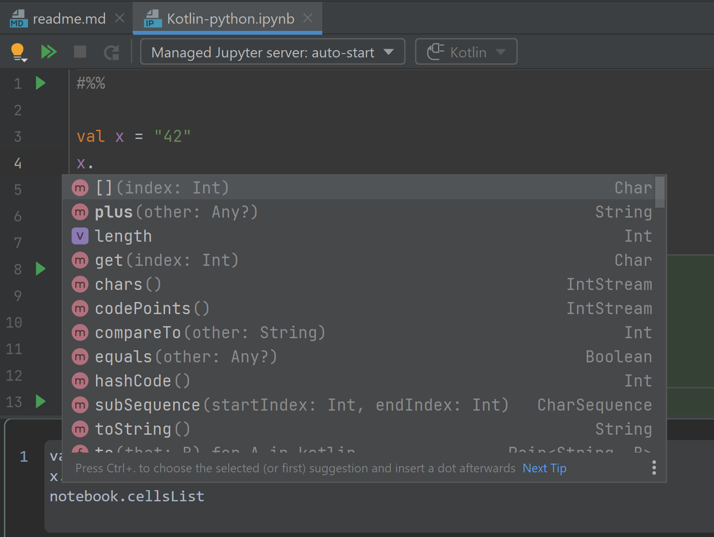
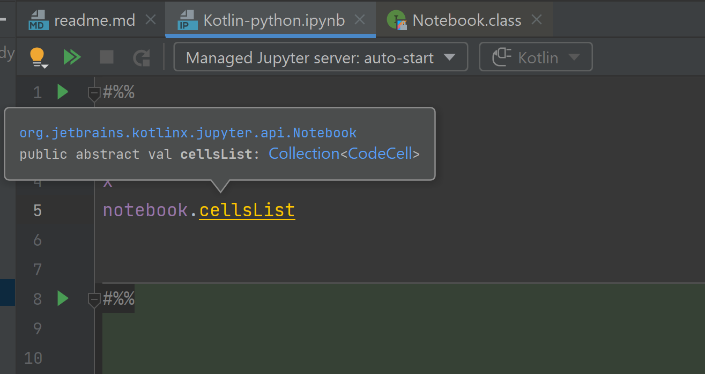
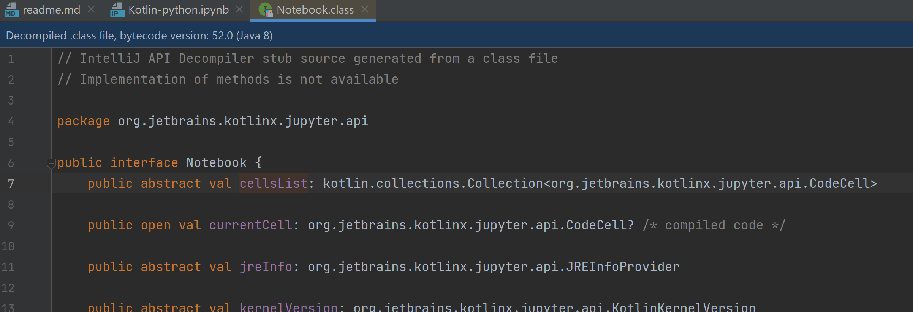
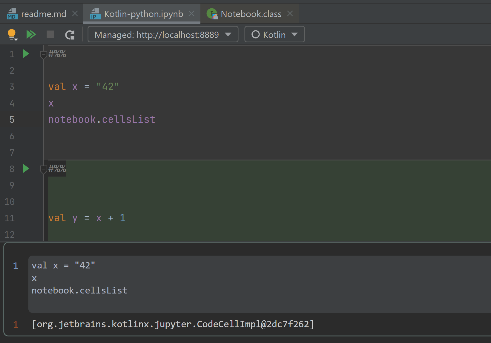

[][Marketplace]
[][Marketplace]
# Jupyter plugin extension for Kotlin language support

<!-- Plugin description -->
Kotlin support for running and editing Jupyter notebooks in IntelliJ IDEA
<!-- Plugin description end -->

## Features
Very limited number of features is currently supported.

### Code insight in notebook cells
Code completion and errors highlighting are supported

### Code navigation
You may also navigate to the symbols.
Symbols defined inside the notebook are supported.

### Executing Kotlin cells
You may also run cells, but you need to set up Python interpreter
in order to do it.

Note that after cell execution undefined symbol `x` from the next cell
has been resolved, and now you may refer it in any cell with relevant
code insight.

## Troubleshooting
There could be some problems during Kotlin notebooks evaluation. In some cases they could be solved by a user.

### Cannot access script base class
This problem usually appears when the user places notebooks inside the source root.
In this case dependencies of the notebook are the same as the dependencies for this source root
(so, it doesn't include scripting dependencies).
Please, move the notebook files out of source roots and place them i.e. in project root.

## Requirements and dependencies
This plugin requires that you have [IntelliJ IDEA Ultimate][IDEA Ultimate] 
with the [Python plugin][Python Ultimate plugin] and [Kotlin plugin][Kotlin Ultimate plugin]
installed. The actual dependency versions are specified in the `plugin.xml`

To run Kotlin notebooks you will also need to have Kotlin Jupyter kernel installed.

To install nightly versions of IntelliJ IDEA you may use the [Toolbox app][Toolbox].

## Running from sources
To run plugin from sources do the following:
1. If you are using development version of IntelliJ IDEA as a build dependency,
   turn on JetBrains VPN. If you are getting 401 HTTP error during the build,
   it's most likely that you need to restart VPN/IDE.
2. Open this repository in IntelliJ IDEA (Community or Ultimate)
3. Perform Gradle project import. After successful import IDEA distribution ZIP and folder
   should appear in `artifacts` folder
4. Set Gradle JVM setting to `artifacts/<distribution>/jbr` folder. This step is needed because
   usual JVMs generally do not include [JCEF][JCEF in IDEA], and notebook rendering will not work with them.
5. Run `runIde` Gradle task from `intellij` task group
6. To run notebook cells you will need to set up Python SDK for your project and
   then choose this SDK as Python interpreter in Jupyter plugin settings.

[Marketplace]: https://plugins.jetbrains.com/plugin/16340-kotlin-for-jupyter
[IDEA Ultimate]: https://www.jetbrains.com/idea/
[Toolbox]: https://www.jetbrains.com/toolbox-app/
[Python Ultimate plugin]: https://plugins.jetbrains.com/plugin/631-python/versions
[Kotlin Ultimate plugin]: https://plugins.jetbrains.com/plugin/6954-kotlin/versions/ideadev
[JCEF in IDEA]: https://blog.jetbrains.com/platform/2020/07/javafx-and-jcef-in-the-intellij-platform/
